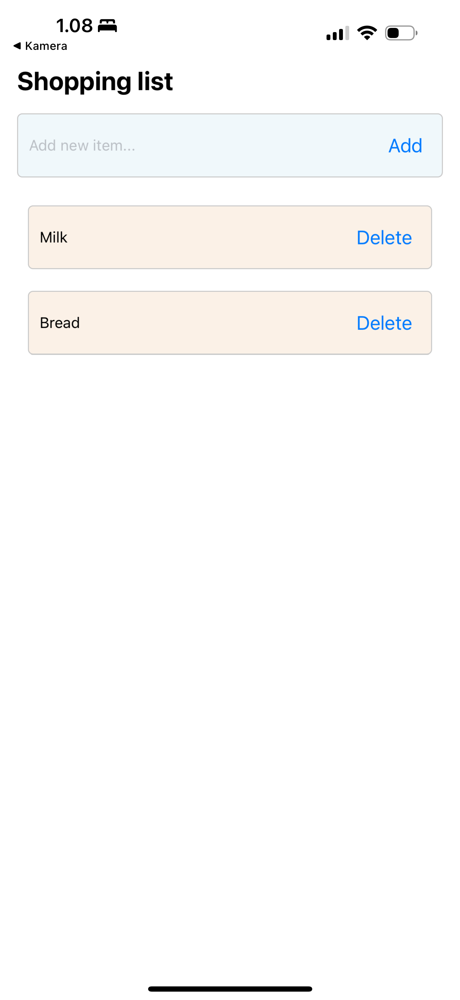

# Web-ja-hybriditeknologiat-mobiiliohjelmoinnissa-viikkotehtava-7

## Assingment. Simple Todolist with reducer

Goal for this exercise is to create a simple todo list using reducer. App displays list, where user can add new tasks and remove existing ones. New tasks are added using TextInput and Save button. Row is removed, if user presses it. Use FlatList to display list on screen.

Data (state) of the list is saved (on memory) using useReducer, which also implements actions for adding and removing rows. There is no need to persist data (e.g. AsyncStorage).

## Implemented UI

